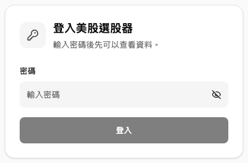
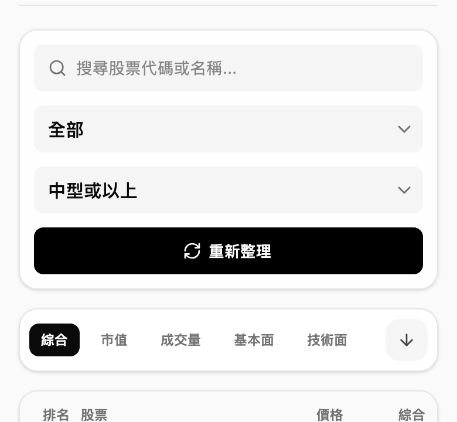
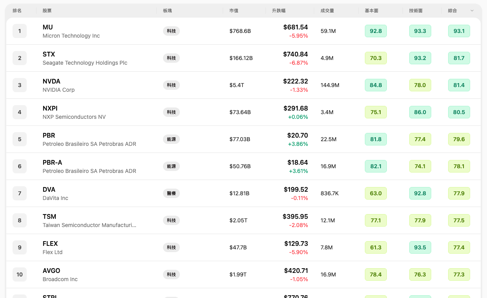
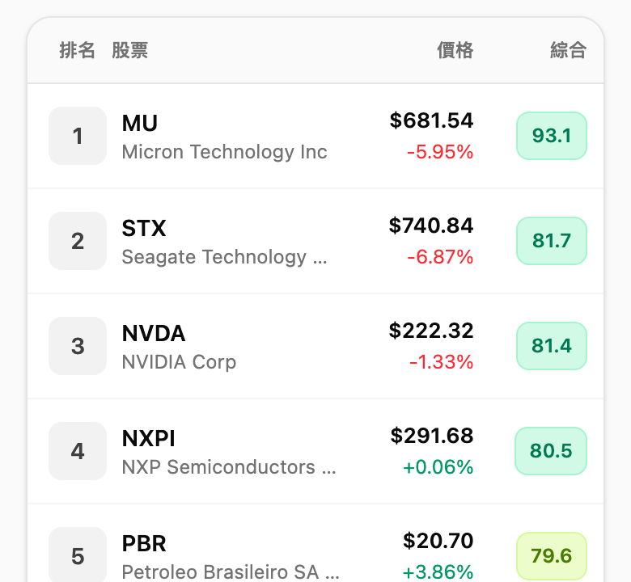
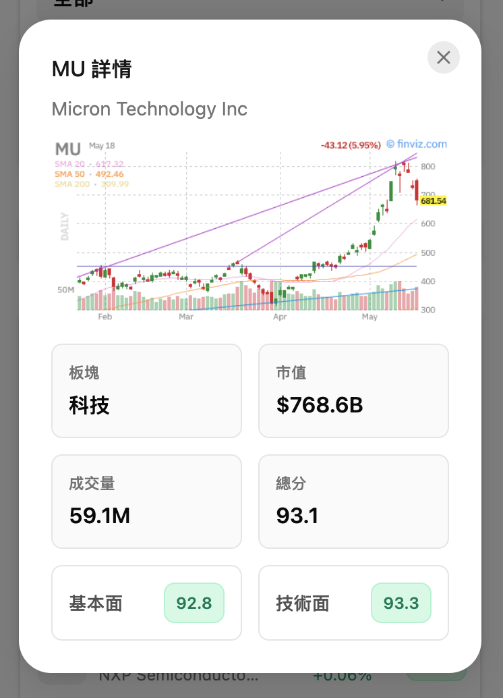
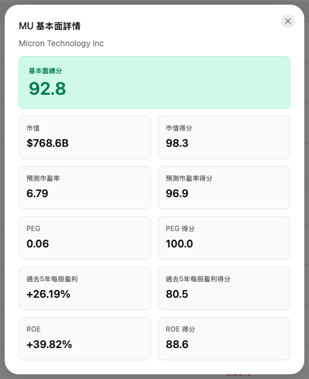
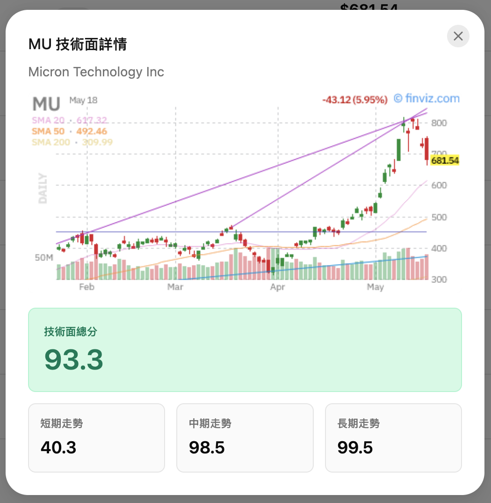

# 美股選股器

網站：https://screener.on99.app/

一個用嚟快速篩選美股嘅前端工具。支援密碼登入、搜尋 ticker / 公司名、按板塊同市值篩選、表格排序、Finviz 圖表、基本面 / 技術面 / 綜合分詳情，以及手機版列表操作。

## 功能

- 密碼登入，未登入唔會顯示選股資料。
- 搜尋股票代碼或公司名，例如 `AAPL`、`Microsoft`。
- 用板塊、市值篩選股票。
- 用市值、升跌幅、成交量、基本面、技術面、綜合分排序。
- 桌面版用表格顯示完整結果；手機版用精簡列表顯示排名、股票、價格同目前排序指標。
- 按股票可查看價格圖表同股票詳情。
- 按「基本面」、「技術面」分數可查看細項評分。
- 按「綜合」分數可查看股票詳情。
- 支援深色模式。

## 使用教學

### 1. 登入

打開網站後，輸入密碼，再按「登入」。

### 2. 用篩選器搵股票

登入後，上方會見到搜尋、板塊、市值同重新整理。

- 搜尋：輸入股票代碼或公司名。
- 板塊：按行業分類篩選。
- 市值：揀想睇嘅市值範圍。
- 重新整理：重新向伺服器攞最新篩選結果。

手機版會將篩選器同排序控制排成直向，方便單手操作。

### 3. 睇結果列表

桌面版會用表格顯示股票排名、板塊、市值、升跌幅、成交量、基本面、技術面同綜合分。

重點睇呢幾欄：

- 排名：目前排序下嘅名次。
- 升跌幅：即日價格變化。
- 基本面：財務及估值相關分數。
- 技術面：走勢相關分數。
- 綜合：基本面同技術面整合後嘅總分。

有箭嘴嘅欄位可以排序。按一次改排序欄位，再按可以切換升序 / 降序。

桌面版按股票名稱會開價格圖表；按「綜合」分數會開股票詳情。

手機版結果會簡化成列表。每行顯示排名、股票、價格同目前排序指標。

想睇更多股票資料，可以打開股票詳情。桌面版按「綜合」分數會打開股票詳情；手機版直接按其中一隻股票亦會打開同一個詳情視窗。

股票詳情入面，「基本面」同「技術面」分數係可以按嘅按鈕。按「基本面」會打開基本面詳情；按「技術面」會打開技術面詳情。

### 4. 查看基本面詳情

喺桌面版表格按「基本面」分數，或者喺股票詳情按「基本面」按鈕，會打開「基本面詳情」。

呢個視窗會顯示：

- 基本面總分
- 市值得分
- PEG 得分
- 過去 5 年每股盈利得分
- ROE 得分
- ROIC 得分
- 預測市盈率得分
- 市銷率得分
- 市現率得分
- 過去 5 年每股營收得分
- 純利率得分
- 負債/資產比率得分

用法好直接：總分越高，代表基本面模型評分越好；如果總分高但某個細項低，就要再睇清楚係估值、盈利增長定 ROE 拖低。

### 5. 查看技術面詳情

喺桌面版表格按「技術面」分數，或者喺股票詳情按「技術面」按鈕，會打開「技術面詳情」。

技術面詳情會分開顯示：

- 價格圖表
- 技術面總分
- 短期走勢
- 中期走勢
- 長期走勢

如果短期高但長期低，通常代表近期轉強但長線未確認；如果三段都高，就代表走勢比較一致。

### 6. 建議流程

1. 先用「市值」同「板塊」收窄範圍。
2. 用「綜合」排序，搵最高分股票。
3. 打開股票詳情睇價格圖表、板塊、市值、成交量同總分。
4. 逐隻打開「基本面詳情」，避開估值或財務質素明顯差嘅股票。
5. 再打開「技術面詳情」，確認短中長期走勢係咪配合。
6. 最後按需要用搜尋直接查特定 ticker。

呢個工具係幫你快速篩選同比較股票，唔係投資建議。真正落注前，最好再睇公司新聞、財報同自己嘅風險承受能力。
